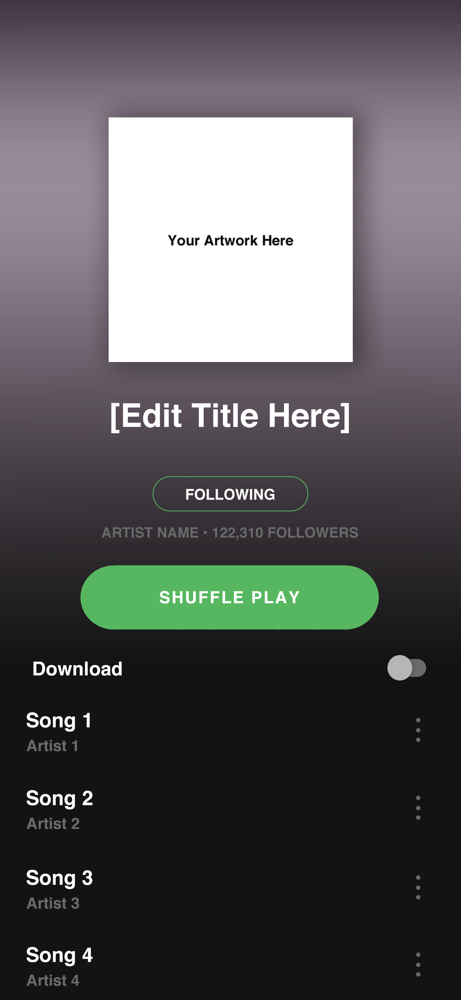

# Spotify

[](https://wakatime.com/badge/user/332327c6-1242-43d9-9a82-aa2db241d18e/project/02864809-0344-4480-b274-b5b6581ee7ba)

Le but de ce projet est d'évaluer mes compétences en HTML/CSS, en compréhension de documentations techniques (API) et en framework JS (REACT) sous forme de mini projet.
Il se fera en deux parties, implémentation de la maquette puis interfacer avec l'API Spotify.
Cette reproduction du site Spotify a été faite via une approche Mobile First.

## Mockups



## Lancer le projet en local

Cloner le projet

```bash
  git clone git@github.com:arasolonjatovo/spotify.git
```

Aller dans le dossier du projet

```bash
  cd spotify
```

Installer les dépendances

```bash
  npm install
```

Lancer le serveur

```bash
  npm run start
```

## Référence couleurs

| Couleur    | Hex                                                              |
| ---------- | ---------------------------------------------------------------- |
| Principale |  #57B75F |
| Secondaire |  #6B6C6D |
| Texte      |  #FFFFFF |

## Documentation

[Documentation de l'API Spotify](https://developer.spotify.com/documentation/web-api)

## Tech Stack

**Client:** React

**Server:** //

## Authors

- [@arasolonjatovo](https://github.com/arasolonjatovo)
